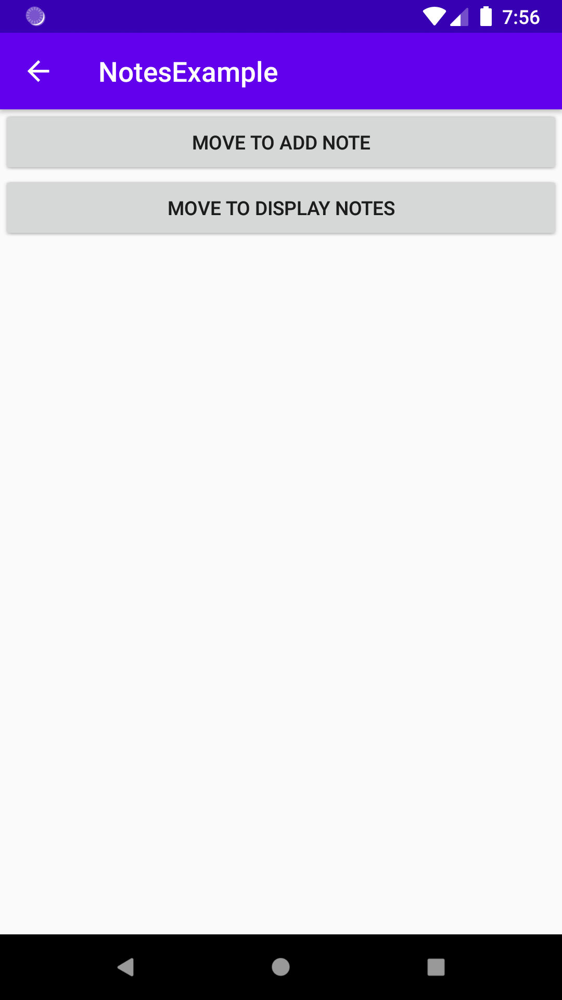
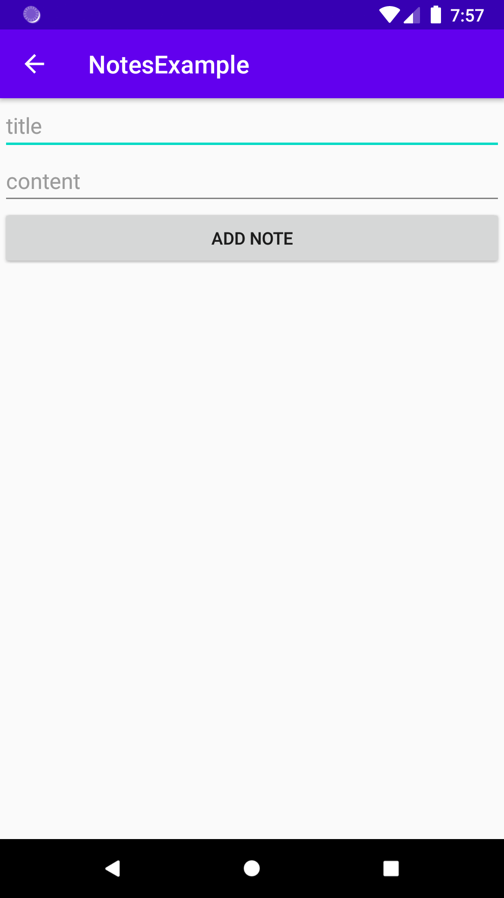
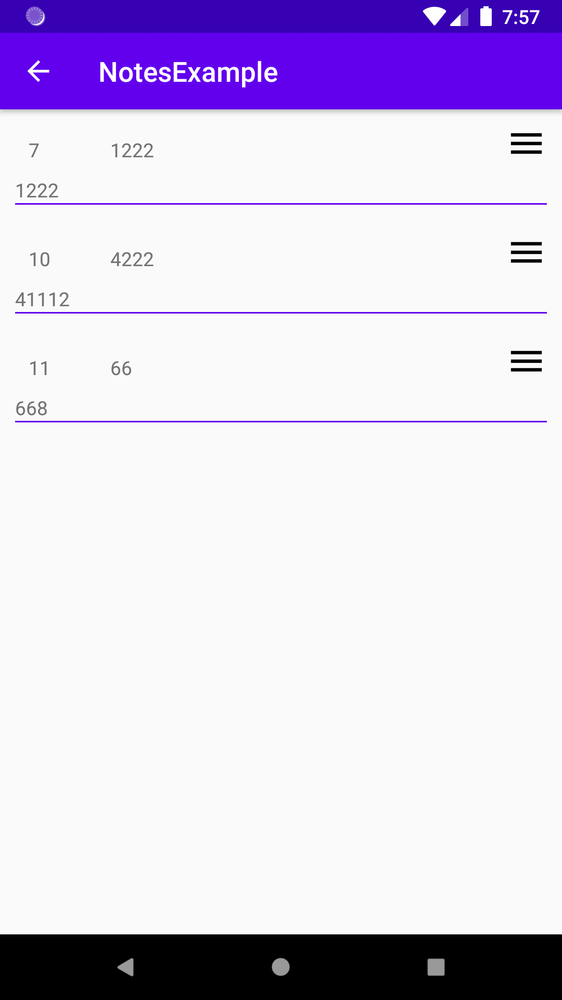
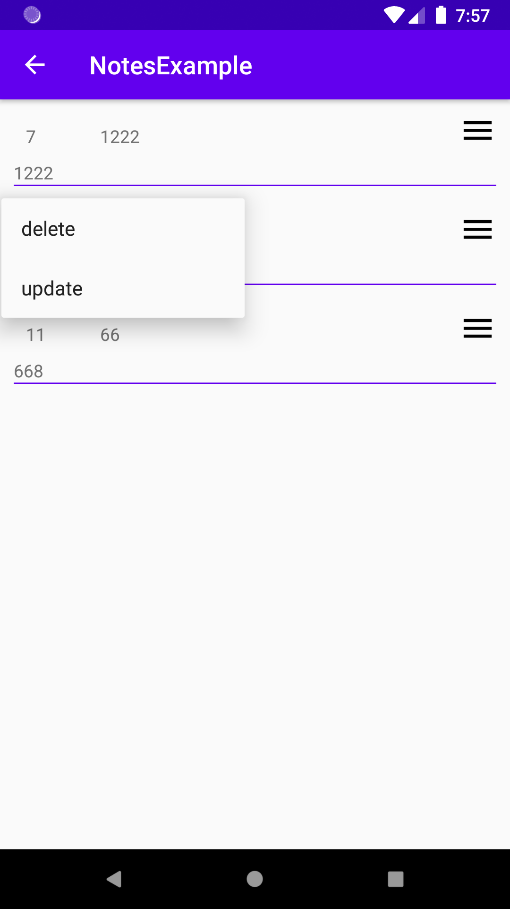
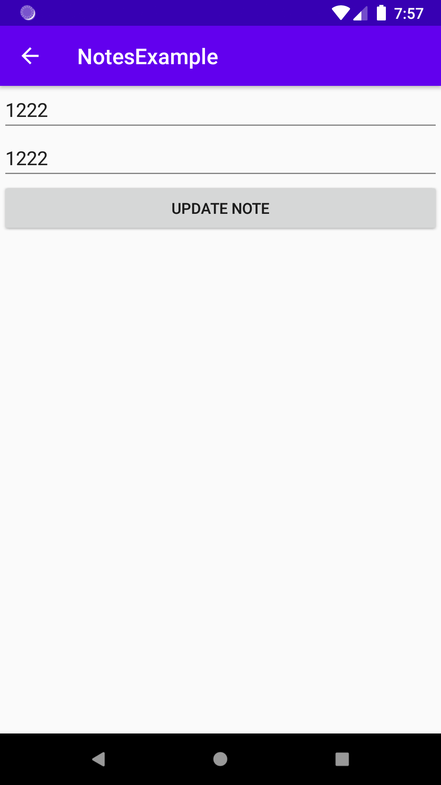

# notesExample
kotlin example that helps developers to understand a lot of Jetpack components 
 
Idea => app that helps users from saving their notes and have the ability to display, delete, or update notes

<h2>Technology used<h2/>
  <ul>
<h5><li>Android</li></h5>
<h5><li>Kotlin</li></h5>
<h5><li>MVVM</li></h5>
<h5><li>LiveData</li></h5>
<h5><li>ViewModel</li></h5>
<h5><li>Recyclerview</li></h5>
<h5><li>Room</li></h5>
<h5><li>kotlin Coroutines</li></h5>
<h5><li>Navigation Component</li></h5>
<h5><li>Data Binding (2 ways Data Binding)</li></h5>
<h5><li>Dagger2</li></h5>
<h5><li>Junit4 for UnitTest</li></h5>
  </ul>

 <html>
<table border="1" bordercolor="red" align="center">
    <tr>
        <td border=1 height=450 width=300></img></th>
        <td border=1 height=450 width=300></img></th>
    </tr>
    <tr>
        <td border=1 height=450 width=300></img></th>
        <td border=1 height=450 width=300></img></th>
    </tr>
      <tr>
        <td border=1 height=450 width=300></img></th>
        <td border=1 height=450 width=300></th>
    </tr>
</table>
</html>
